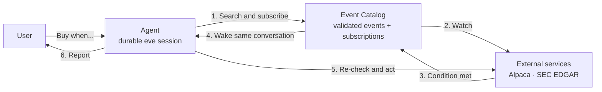

# Event Catalog

> Give AI agents a simple way to say: “Wake me when this happens.”

Tools let an agent act on the world now. Events let the world call the agent back later.

That second direction is surprisingly hard. If an agent needs to wait for a stock price, an order
update, or a new filing, someone usually has to build polling jobs, webhook handlers, queues, and
state management for that one task.

Event Catalog turns waiting into a reusable agent capability. An agent can:

1. discover the events available to it;
2. subscribe with a validated condition;
3. end its turn and park without consuming compute; and
4. resume the same conversation when the condition is met.

This proof of concept runs on [eve](https://eve.dev). eve provides the durable agent session: it
preserves the conversation while it is paused and resumes it later. The Event Catalog provides the
layer that watches the outside world and knows when to wake it.

The demo scenario is agentic trading with Alpaca paper trading and SEC EDGAR. The prompt it is
built around is:

> Buy $100 of NVDA if it falls below $150 today.

The agent waits for the price, checks that the condition is still true when it wakes, places a
paper order, waits for the order outcome, and reports the result—without running a polling loop in
the agent itself.

## How it works



There are five main pieces:

- **The agent** decides what it needs to wait for. It searches the catalog and subscribes through
  tools instead of knowing how every external API works.
- **`catalog/catalog.json`** is the menu of events. Each entry describes the event, its input
  schema, provider characteristics, and what the agent should do after waking.
- **The registry** stores subscriptions and conversation addresses in Upstash Redis.
- **Providers** do the watching. Alpaca uses shared WebSocket connections; EDGAR uses one shared
  polling loop per company because the SEC does not offer a push stream for filings.
- **The wake path** resumes the existing eve session with the event data and catalog-authored
  handling guidance.

This is not a replacement for a workflow engine. eve owns durable execution. The Event Catalog is
the event-discovery and wake-up layer on top.

A deeper technical tour — the full component map, the demo as a sequence diagram, and the
subscription state machine — lives in [`docs/architecture.md`](docs/architecture.md).

## One prompt, two wakes

For the trading demo, the conversation unfolds like this:

1. The user asks to buy NVDA if it crosses below a price.
2. The agent discovers Alpaca's `price.crossesBelow` event and creates a subscription.
3. The turn ends. The eve session parks, and the catalog starts watching Alpaca's market stream.
4. A trade crosses the threshold. The catalog wakes the same conversation.
5. The agent fetches a fresh price and the paper account's buying power.
6. If the condition still holds, it submits a $100 paper order and subscribes to the order result.
7. Alpaca sends the terminal order update. The catalog wakes the conversation again.
8. The agent reports whether the order filled, was canceled, was rejected, or expired.

Why fetch the price again in step 5? Because “the price crossed $150” does not mean “the price is
still below $150.” A wake is evidence about something that happened; it is not guaranteed to be a
current snapshot. The agent fetches current state again before it acts.

## Events available today

All active events are declared in [`catalog/catalog.json`](catalog/catalog.json). Their parameter
schemas are enforced when the agent subscribes.

| Provider | Event | Example | Delivery |
|---|---|---|---|
| Alpaca | `price.crossesBelow` | NVDA crosses from at or above $150 to below it | Shared market-data WebSocket |
| Alpaca | `price.crossesAbove` | NVDA crosses from at or below $175 to above it | Shared market-data WebSocket |
| Alpaca | `order.filled` | A paper order reaches any terminal state | Shared `trade_updates` WebSocket, with a one-time REST check when armed |
| SEC EDGAR | `filing.new` | Apple publishes a new 8-K | One 30-second poll loop per company, shared by all subscribers |

Price events are **edge-triggered**. When the subscription is armed, the provider records the
current price as its baseline. If NVDA is already below $150 then, `price.crossesBelow` waits for a
future downward crossing; it does not fire immediately because the price happens to be on that side
of the threshold. Watching begins only after the agent's turn ends, so a crossing that happens
during that turn is not observed.

Despite its name, `order.filled` wakes for every terminal outcome so the agent never waits forever
on an order that was canceled, rejected, or expired. The wake payload tells the agent which outcome
occurred.

## Run it locally

### Prerequisites

- Node.js 24 or newer
- pnpm (the exact version is pinned in `package.json`)
- the [Vercel CLI](https://vercel.com/docs/cli), authenticated to a Vercel account
- an [Alpaca](https://alpaca.markets) **paper trading** account
- optional: `jq` for formatting JSON responses in the terminal
- optional: a [LangSmith](https://smith.langchain.com) account for traces

The project uses Vercel AI Gateway for model access and Upstash Redis from the Vercel Marketplace
for the subscription registry.

### 1. Install and connect the project

From the repository root:

```bash
pnpm install
vercel link
vercel integration add upstash/upstash-kv
```

`vercel link` connects the local checkout to your Vercel project. The integration command creates
the Redis store used by the catalog. It may also generate Upstash reference-skill files under
`agent/`; check `git status` before committing and see
[`KNOWN_ISSUES.md` issue 5](KNOWN_ISSUES.md#5-vercel-integration-add-installs-agent-skills-as-a-side-effect)
for context.

### 2. Add environment variables

Add these values to the Vercel project's **development** environment:

```bash
vercel env add ALPACA_API_KEY_ID development
vercel env add ALPACA_API_SECRET_KEY development
vercel env add EDGAR_USER_AGENT development
```

Use Alpaca paper credentials. `EDGAR_USER_AGENT` should identify you in the format required by the
SEC, for example `Your Name you@example.com`.

LangSmith is optional. To enable it, also add `LANGSMITH_API_KEY` and
`LANGSMITH_TRACING=true`; `LANGSMITH_PROJECT` selects a project when you do not want the default.
See [`.env.example`](.env.example) for every supported setting.

Pull the project environment into the local checkout:

```bash
vercel env pull .env.local --yes
```

This command also supplies `VERCEL_OIDC_TOKEN`, the short-lived credential AI Gateway uses locally.
It expires after about 12 hours, so pull again before a long test or demo session.

> **Stop the dev server before pulling.** `vercel env pull` overwrites `.env.local`, and an env-file
> change causes eve to reload. A reload drops the catalog's in-process watchers. Keep source-of-truth
> values in Vercel rather than adding local-only values to `.env.local`.

### 3. Start the agent

```bash
pnpm dev
```

The server listens on port **2000**. In another terminal, check that it is healthy:

```bash
curl -sS localhost:2000/eve/v1/health
```

### 4. Start a conversation

Before you send the demo prompt:

- Run it during US market hours if you want to see a real price crossing and fill. The subscription
  waits for a **future** downward crossing; it does not fire just because the price is already below
  the threshold.
- This prompt authorizes the agent to submit a $100 Alpaca paper order without asking for another
  confirmation. The code cannot place a real-money trade.

Find NVDA's latest price in the Alpaca paper dashboard or another live market-data source. Choose a
threshold slightly below it, then replace `175` in this command:

```bash
curl -sS -X POST localhost:2000/catalog/chat \
  -H 'content-type: application/json' \
  -d '{"conversationId":"demo-1","message":"Buy $100 of NVDA if it falls below $175 today."}'
```

The response includes a `sessionId`. Use it to stream the conversation as newline-delimited JSON:

```bash
SESSION_ID='paste-session-id-here'
curl -sS -N "localhost:2000/catalog/sessions/$SESSION_ID/stream"
```

You can inspect all subscriptions and their current state at any time:

```bash
curl -sS localhost:2000/catalog/subscriptions | jq .
```

If `jq` is not installed, omit `| jq .` to see the unformatted JSON.

A follow-up uses the same `conversationId`, which continues the same session:

```bash
curl -sS -X POST localhost:2000/catalog/chat \
  -H 'content-type: application/json' \
  -d '{"conversationId":"demo-1","message":"What are you waiting for right now?"}'
```

### Market-hours note

The live IEX stream sends trades during US market hours, 9:30 a.m.–4:00 p.m. Eastern, Monday through
Friday. A full price-crossing demo needs to run during that window. Pick a threshold slightly below
the current price so the stream can observe a real downward crossing.

For off-hours development, set `ALPACA_DATA_FEED=test` in Vercel, pull the env with the server
stopped, and restart. This uses Alpaca's 24/7 synthetic `FAKEPACA` feed. It exercises the same
connection and subscription path when you subscribe to the `FAKEPACA` symbol, but its price is
often flat, so do not rely on it for a complete crossing-and-trade demo. Expiry and EDGAR wakes
work at any time.

Manual milestone checklists and demo scenarios live in
[`docs/acceptance-tests.md`](docs/acceptance-tests.md).

<!-- TODO after the supervised live demo (task 7): paste the two real AT-7 run transcripts here. -->

## Design choices that matter

### The catalog is executable documentation

The model reads the same JSON Schema that Ajv, a JSON Schema validator, enforces at subscription
time. An event marked `active` must have a registered provider, or the app refuses to boot.
Unimplemented ideas stay marked `planned`: discovery labels them as unavailable, and subscription
rejects them.

### Providers watch once and route many times

Polling never scales with the number of subscriptions. Alpaca offers push streams, so the provider
shares one market-data connection and one account-level order-update connection. EDGAR requires
polling, so every subscriber for the same company shares one loop keyed by that company's CIK
(the SEC's numeric company identifier).

### Subscriptions arm after the turn ends

A new subscription starts as `pending` and becomes `armed` only after the agent's turn completes.
That prevents a fast event from trying to wake a conversation before it has parked.

The successful lifecycle is:

```text
pending → armed → delivering → fired | expired
```

A subscription can instead move to `failed` while arming or delivering. Every subscription state
and terminal `lastError` is available through `GET /catalog/subscriptions`; transient WebSocket or
EDGAR polling errors stay in the server logs while the provider keeps watching.

### Event data cannot become trusted instructions

Provider payloads are external data. Wake guidance is trusted instruction text owned by
`catalog.json`. The wake route rejects caller-supplied guidance and resolves it on the server from
the subscription's validated provider and event. A market tick or filing can inform the agent, but
it cannot tell the agent what instructions to follow.

## What is durable in this POC?

This repository is a local-first proof of concept. Its boundary is deliberate:

| Layer | Stored where | After a dev-server restart |
|---|---|---|
| eve conversation | eve's durable local workflow state | Resumable |
| Subscription and conversation records | Upstash Redis | Preserved |
| WebSockets, poll loops, and expiry timers | In the Node.js process | Lost; create a fresh subscription |

Other current boundaries:

- Trading is hard-coded to Alpaca's paper host. The agent can only place buy-only market orders for
  a fixed dollar amount, valid for the trading day. There is no real-money endpoint in this
  repository.
- The trading demo is fully autonomous within those bounds; it has no human approval step.
- `/catalog/wake` is unauthenticated and intended only for this local POC. Someone who knows a live
  subscription ID can trigger an early or fake wake and supply its data and timestamps. They cannot
  inject trusted catalog guidance, but the endpoint is not production-hardened.
- Delivery claims are single-process. A production, multi-instance version would move fired events
  through a durable transport such as Vercel Queues and use cross-instance deduplication.
- Only conversations started through `/catalog/chat` can be woken. Other interfaces would need to
  hand the catalog their conversations' resume keys (eve's continuation tokens).

See [`KNOWN_ISSUES.md`](KNOWN_ISSUES.md) before changing eve channel code or troubleshooting a
demo. It records the sharp edges found while building against eve 0.22.5 beta.

## Verification and observability

Run the automated checks with:

```bash
pnpm typecheck
pnpm test
```

`pnpm test` uses Node's built-in test runner and needs the Redis credentials in `.env.local`.

While the app runs, you can follow it at three levels:

- **Catalog logs** show each subscription, provider action, state transition, and error in the
  terminal.
- **The session stream** shows the conversation's turns and tool events as newline-delimited JSON.
- **LangSmith** optionally records model and tool spans when tracing is configured.

## Repository guide

| Path | Purpose |
|---|---|
| [`agent/`](agent/) | eve agent instructions, tools, custom conversation channel, and tracing |
| [`catalog/catalog.json`](catalog/catalog.json) | Declarative event registry and wake guidance |
| [`catalog/registry.ts`](catalog/registry.ts) | Subscription state and conversation mapping in Redis |
| [`catalog/wake.ts`](catalog/wake.ts) | Arming, expiry, delivery, and wake-envelope construction |
| [`catalog/providers/`](catalog/providers/) | Shared Alpaca streams and coalesced EDGAR polling |
| [`docs/prd-draft.md`](docs/prd-draft.md) | Original product brief and future direction |
| [`docs/acceptance-tests.md`](docs/acceptance-tests.md) | Manual acceptance tests, including the full trading demo |
| [`KNOWN_ISSUES.md`](KNOWN_ISSUES.md) | eve and local-development pitfalls discovered in this POC |
