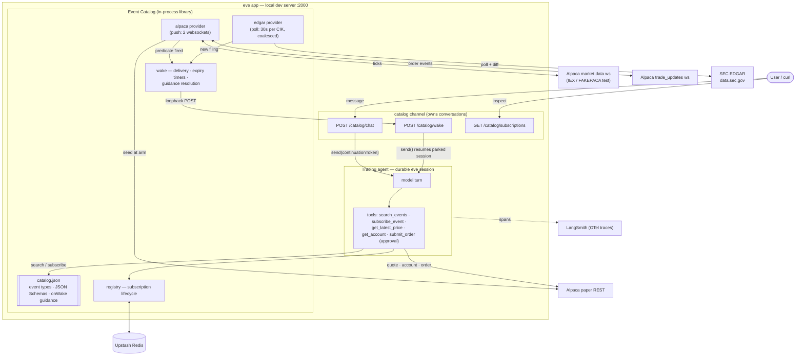
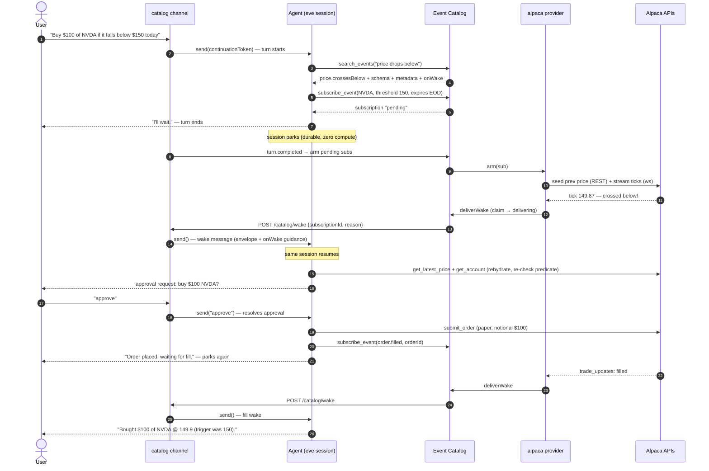
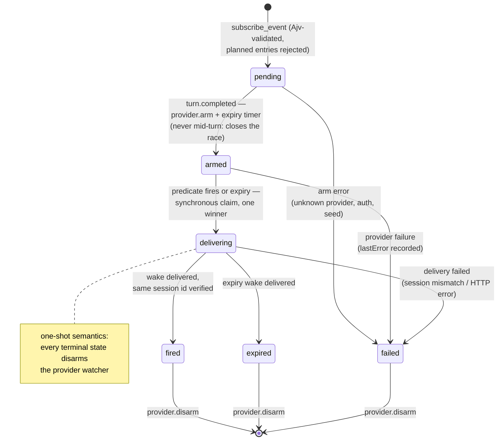

# Event Catalog

**Connections are how agents call the world; the Event Catalog is how the world calls back.**

AI agents are excellent at reacting *now* and terrible at reacting *later*. This POC gives an
[eve](https://eve.dev) agent the missing primitive: **"wake me when X becomes true."** The agent
discovers event sources it knows nothing about, subscribes with typed predicates, suspends
(durably, at zero compute), and is resumed by the catalog when the event fires — interrupts for
AI agents. The vertical slice is agentic trading: Alpaca paper trading + SEC EDGAR filings.

The demo sentence the whole system exists for:

> *"Buy $100 of NVDA if it falls below $150 today."*

The agent finds the right event source in the catalog, subscribes, parks, wakes on the price
cross, re-checks reality, asks a human for approval, paper-trades, parks again, and reports the
fill — without a single polling loop in agent code.

## System architecture



Key moves, bottom to top:

- **The catalog is a JSON file.** `catalog/catalog.json` declares every event type: a
  model-facing description, a JSON Schema for its parameters (enforced with Ajv at subscribe
  time — the schema the model reads during discovery is the one that validates its input), honest
  provider metadata (freshness, latency, auth, cost, durability), and `onWake` — prompt-shaped
  handling guidance delivered back to the agent when the event fires. A boot-time honesty check
  refuses to advertise anything without a registered handler.
- **Providers watch the world so agents don't.** Push when the source offers it (Alpaca: one
  shared market-data websocket, one account-level `trade_updates` stream), coalesced polling when
  it doesn't (EDGAR: one 30s poll loop per watched company, regardless of subscriber count).
  REST is only for *seeding* state at arm time.
- **The wake is the primitive.** eve sessions are durable workflows that park between turns. The
  catalog channel owns each conversation's continuation token, so waking an agent is one `send()`
  on that token — same session, full memory, plus an envelope that makes time-passage explicit.

## The demo flow



Two details that look small and aren't:

- **Arm-on-turn-complete** (step 9): subscriptions stay `pending` while the agent's turn is still
  running and arm only after it ends — otherwise a fast tick could try to wake a session that
  hasn't parked yet.
- **Rehydrate + re-check** (step 17): "price crossed 150" is not "price is still 150." The wake's
  `onWake` guidance tells the agent its snapshot is stale by definition (TOCTOU); it re-fetches
  reality before acting, and declines to trade if the condition no longer holds.

## Subscription lifecycle



Every transition is visible at `GET /catalog/subscriptions` (status, timestamps, `lastError`) —
the lifecycle *is* the observability model. Wakes are effectively-once: at-least-once delivery
plus a synchronous in-process claim and idempotent resume, with a session-id check that detects
(loudly) if eve's delivery fallback ever mints a fresh session instead of resuming the right one.

## What the catalog offers today

| provider | event | how it watches | freshness | auth | cost |
|---|---|---|---|---|---|
| alpaca | `price.crossesBelow` | shared websocket, edge-triggered, seeded prev | real-time (IEX) | paper keys | free |
| alpaca | `price.crossesAbove` | same | real-time | paper keys | free |
| alpaca | `order.filled` | `trade_updates` push, REST seed at arm; wakes on **any** terminal status | seconds | paper keys | free |
| edgar | `filing.new` | 30s poll per CIK, subscribers coalesced, accession diff | minutes | none (User-Agent required) | free |

Edge-triggered means exactly that: a crossing needs the price to actually *cross*. A subscription
whose price already sits past the threshold will never fire — it expires, and the agent tells you
the condition never triggered (not that the price never got there).

## Running it

Prereqs: Node ≥ 24, pnpm (version pinned via `packageManager`), a Vercel account (linked; OIDC
handles model auth via AI Gateway), an Alpaca **paper** account, a LangSmith key. All secrets
live in Vercel's project env store: `vercel env pull .env.local --yes` (only while the dev server
is **down** — see below). Var names: `.env.example`.

```bash
pnpm install
pnpm dev          # eve dev server on port 2000
pnpm test         # 86 node:test cases (talks to live Redis)
pnpm typecheck
```

Talk to the agent:

```bash
# start a conversation (returns a sessionId)
curl -s -X POST localhost:2000/catalog/chat -H 'content-type: application/json' \
  -d '{"conversationId":"demo-1","message":"Buy $100 of NVDA if it falls below $XXX today."}'

# watch the agent live
curl -N localhost:2000/catalog/sessions/<sessionId>/stream

# approvals are plain replies on the same conversation
curl -s -X POST localhost:2000/catalog/chat -H 'content-type: application/json' \
  -d '{"conversationId":"demo-1","message":"approve"}'

# inspect every subscription's lifecycle
curl -s localhost:2000/catalog/subscriptions | jq .
```

Demo guidance: run during US market hours (9:30–16:00 ET); pick a threshold slightly **below**
the current price (edge-triggered — it has to cross downward). Off-hours, set
`ALPACA_DATA_FEED=test` to stream Alpaca's 24/7 synthetic ticker `FAKEPACA` through the same
pipeline — note its price is flat in practice, so crossings won't fire on it; expiry wakes,
EDGAR wakes, and the approval flow all work any time. The full manual test suite lives in
`docs/acceptance-tests.md` (AT-1 … AT-9).

<!-- TODO after the supervised live demo (task 7): paste the two real AT-7 run transcripts here. -->

## Observability

- **LangSmith**: every turn exports OTel spans (model calls, tool calls, full inputs/outputs)
  to the project in `$LANGSMITH_PROJECT`. Requires `LANGSMITH_TRACING=true` (silent no-op
  without it — see KNOWN_ISSUES #6).
- **eve Agent Runs**: sessions/turns/tool calls in the Vercel dashboard, no setup.
- **Catalog logs**: one structured line per action (`[catalog] …`, `[alpaca] …`, `[edgar] …`),
  always carrying conversation + subscription ids. The console tells the whole story.

## Honest boundaries

This is a local-first POC, and says so:

- eve **sessions** are durable (they survive restarts — that's Vercel Workflows). The catalog's
  **watchers** (websockets, poll loops, expiry timers) are in-process: a dev-server restart keeps
  subscriptions in Redis but drops the watching; re-subscribe. Any `.env.local` write hot-reloads
  the server and does the same (`KNOWN_ISSUES.md` #1–2).
- Trading is hard-coded to Alpaca's **paper** host. Notional, buy-side, market/day orders only,
  every order behind a human approval gate. There is no code path to real money.
- Wake-time `onWake` guidance is resolved server-side from `catalog.json` only; the wake route
  rejects any caller-supplied guidance (400). Event payloads are data, never instructions.
- At production scale, one seam changes: `deliverWake` becomes a publish to a durable topic
  (Vercel Queues) — fired events are low-volume and must-not-lose, while raw ticks stay filtered
  at the provider edge. The claim/idempotency semantics were built for at-least-once delivery
  from day one. Cross-agent dedup, multi-region, and true webhook providers live in the PRD
  appendix, not in this code.

## Map of the repo

| path | what |
|---|---|
| `docs/prd-draft.md` | the PRD this implements |
| `docs/acceptance-tests.md` | manual test scripts per milestone (AT-1 … AT-9) |
| `AGENTS.md` | project rules (north star, Vercel-primitives-only, catalog honesty, TDD) |
| `KNOWN_ISSUES.md` | every sharp edge found building on eve 0.22.5 beta — read before touching channel code |
| `agent/` | the eve agent: 16-line prompt, 5 tools, catalog channel, OTel |
| `catalog/` | the Event Catalog: `catalog.json`, registry, wake, providers |
