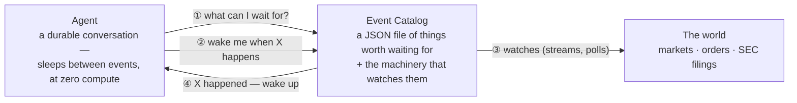
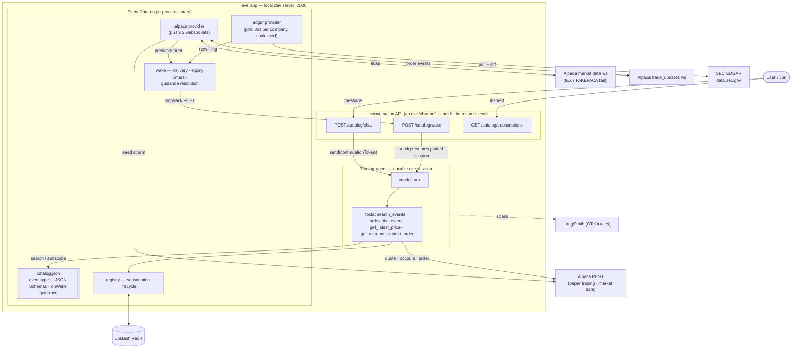
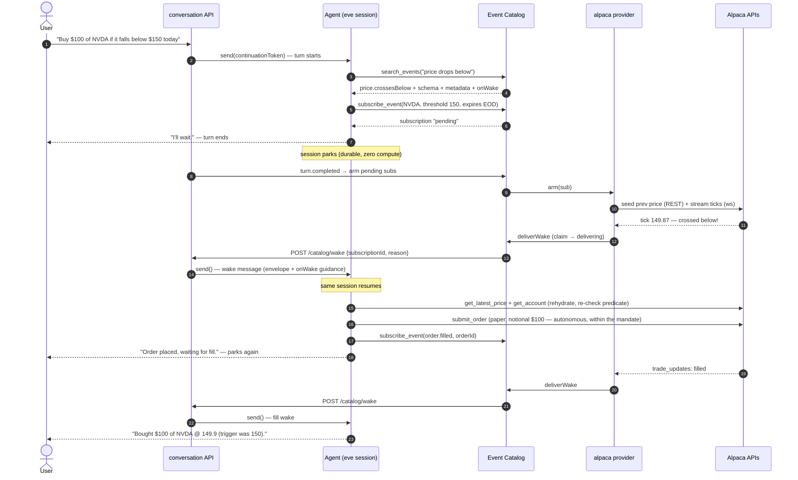
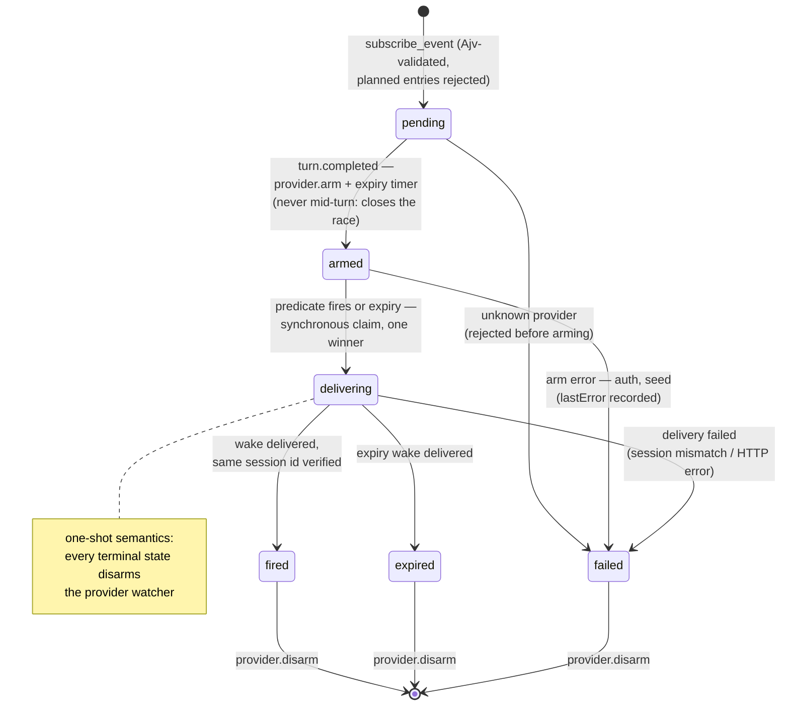

# Event Catalog — architecture deep-dive

*Technical companion to the [README](../README.md): full component map, the demo as a sequence
diagram, the subscription state machine, and design rationale in detail.*

**Tool calls are how agents call the world; events are how the world calls back. The Event
Catalog is where agents discover and subscribe to them.**

AI agents are excellent at reacting *now* and terrible at reacting *later*. This POC gives an
[eve](https://eve.dev) agent the missing primitive: **"wake me when X happens."** The agent
discovers event sources it knows nothing about, subscribes with typed predicates, suspends
(durably, at zero compute), and is resumed by the catalog when the event fires — interrupts for
AI agents. The vertical slice is agentic trading: Alpaca paper trading + SEC EDGAR filings.

The demo sentence the whole system exists for:

> *"Buy $100 of NVDA if it falls below $150 today."*

The agent finds the right event source in the catalog, subscribes, parks, wakes on the price
cross, re-checks reality, paper-trades autonomously within the stated mandate, parks again, and
reports the fill — without a single polling loop in agent code and without a human in the loop.

**eve in two sentences** (enough to read the diagrams; the rest is at [eve.dev](https://eve.dev)):
an eve *session* is a durable conversation — it can pause ("park") for hours at zero compute,
survive restarts, and be resumed later by whoever holds its resume key (the *continuation
token*). Everything below runs locally in dev, including the workflow engine — "durable" does
not mean "in Vercel's cloud" here.

## The big picture



That's the whole idea. The agent never polls, never holds a connection, never knows Alpaca or
SEC exist — it asks the catalog what can be waited for, subscribes, and goes to sleep. The
catalog does the watching and calls back. You talk to the agent with `POST /catalog/chat`
(each `conversationId` is one ongoing conversation); it lives next to `/catalog/wake` because
of an eve rule: only whoever *starts* a conversation holds the key to *resume* it — and the
catalog must hold that key to wake sleeping agents.

<details>
<summary><b>Under the hood</b> — the full component map</summary>



</details>

Key moves, bottom to top:

- **The catalog is a JSON file.** `catalog/catalog.json` declares every event type: a
  model-facing description, a JSON Schema for its parameters (enforced with Ajv, a JSON Schema
  validator, at subscribe time — the schema the model reads during discovery is the one that
  validates its input), honest provider metadata (freshness, latency, auth, cost, durability),
  and `onWake` — prompt-shaped handling guidance delivered back to the agent when the event
  fires. Entries whose provider isn't implemented yet are marked `"planned"`: search labels
  them, subscribe rejects them, and a boot-time honesty check refuses to advertise any "active"
  entry without a registered handler.
- **Providers watch the world so agents don't.** Push when the source offers it (Alpaca: one
  shared market-data websocket, one account-level `trade_updates` stream), coalesced polling when
  it doesn't (EDGAR: one 30s poll loop per watched company — keyed by CIK, SEC's numeric company
  id — regardless of subscriber count). REST is only for *seeding* state when a subscription
  arms (see below), never for watching.
- **The wake is the primitive.** Waking an agent is one `send()` on the conversation's
  continuation token — same session, full memory, plus an envelope that makes time-passage
  explicit. Delivery loops back over HTTP into the conversation API (rather than an in-process
  call) because that component alone holds the resume keys — and it makes every
  wake visible in the logs. The wake route is unauthenticated (local-only POC), which is exactly
  why it *rejects* any caller-supplied guidance: the model-trusted instructions can only come
  from `catalog.json`, resolved server-side. Event payloads are data, never instructions.

## The demo flow



("Notional" = a dollar-amount order, not a share count. "Arming" a subscription = the provider
actually starts watching for it; disarming stops the watching.)

Two details that look small and aren't:

- **Arm-on-turn-complete** (step 9): subscriptions stay `pending` while the agent's turn is still
  running and arm only after it ends — otherwise a fast tick could try to wake a session that
  hasn't parked yet. The honest flip side: the world isn't watched until arming, so a price that
  crosses *and comes back* during those few in-turn seconds is never seen — the baseline
  ("seeded prev") is the price at arm time.
- **Rehydrate + re-check** (step 15): "price crossed 150" is not "price is still 150" — a
  time-of-check-to-time-of-use (TOCTOU) gap. The wake's `onWake` guidance tells the agent its
  snapshot is stale by definition; it re-fetches reality before acting, and declines to trade if
  the condition no longer holds — that judgment is the agent's own; there is no human in the
  loop (a deliberate full-autonomy choice; see Honest boundaries).

## Subscription lifecycle



(Once armed, transient provider trouble — an EDGAR poll error, a websocket hiccup — logs loudly
and keeps watching; it does not fail the subscription.)

Every transition is visible at `GET /catalog/subscriptions` (status, timestamps, `lastError`) —
the lifecycle *is* the observability model. Wakes are effectively-once: at-least-once delivery
plus a synchronous in-process claim and idempotent resume, with a session-id check that detects
(loudly) if eve's delivery fallback ever mints a fresh session instead of resuming the right one.
Multiple wakes aimed at one session (say, two subscriptions firing together) arrive as
sequential turns — eve buffers deliveries to a busy session.

## What the catalog offers today

"Edge-triggered" below means the price must actually *cross* the threshold — the provider seeds a
baseline price when the subscription arms and fires only on a genuine crossing, never because the
price already sat past the threshold.

| provider | event | how it watches | freshness | auth | cost |
|---|---|---|---|---|---|
| alpaca | `price.crossesBelow` | shared websocket, edge-triggered vs seeded baseline | real-time (IEX) | paper keys | free |
| alpaca | `price.crossesAbove` | same | real-time | paper keys | free |
| alpaca | `order.filled` | `trade_updates` push, REST seed at arm; wakes on **any** terminal status | real-time (sub-second push) | paper keys | free |
| edgar | `filing.new` | 30s poll per company (CIK), subscribers coalesced, accession diff | minutes | none (User-Agent required) | free |

A subscription whose condition never triggers simply expires — and the agent tells you the
condition never *triggered* while it watched (which is not a claim about where the price was).

## Running it

Prereqs: Node ≥ 24 and pnpm (exact version pinned via `packageManager`), a
[Vercel](https://vercel.com) account, an [Alpaca](https://alpaca.markets) **paper** account, and
optionally a [LangSmith](https://smith.langchain.com) key — tracing is a silent no-op without
one; the agent runs fine.

First-time setup from a fresh clone:

```bash
pnpm install
vercel link                    # creates/links YOUR Vercel project (model auth rides on it)
vercel integration add upstash/upstash-kv   # provisions the Redis that backs the registry
vercel env add <NAME> development           # once per var in .env.example (Alpaca keys, etc.)
vercel env pull .env.local --yes            # writes .env.local, incl. a VERCEL_OIDC_TOKEN
```

Secrets live in *your* Vercel project's env store, not in local files: `vercel env pull`
**overwrites** `.env.local` wholesale, so anything added only locally is lost on the next pull.
The `VERCEL_OIDC_TOKEN` (model auth via Vercel's AI Gateway — no provider API key needed) expires
after ~12h: re-pull before a session, and only while the dev server is **down** — any
`.env.local` write hot-reloads the server and drops in-process state (`KNOWN_ISSUES.md` #2).

```bash
pnpm dev          # eve dev server on port 2000
pnpm test         # 86 node:test cases (needs the Redis creds in .env.local)
pnpm typecheck
```

Talk to the agent:

```bash
# start a conversation (returns a sessionId; replace the price!)
curl -s -X POST localhost:2000/catalog/chat -H 'content-type: application/json' \
  -d '{"conversationId":"demo-1","message":"Buy $100 of NVDA if it falls below $175 today."}'

# watch the agent live
curl -N localhost:2000/catalog/sessions/<sessionId>/stream

# follow-ups are plain replies on the same conversation (same conversationId = same session)
curl -s -X POST localhost:2000/catalog/chat -H 'content-type: application/json' \
  -d '{"conversationId":"demo-1","message":"What are you waiting on right now?"}'

# inspect every subscription's lifecycle
curl -s localhost:2000/catalog/subscriptions | jq .
```

First run: expect `{"ok":true,...}` from `curl localhost:2000/eve/v1/health`, a `sessionId` in
the chat response, and NDJSON lifecycle events on the stream — `docs/acceptance-tests.md` AT-1
and AT-2 spell out exactly what success looks like, step by step; AT-3 … AT-9 script everything
else. If something misbehaves, read `KNOWN_ISSUES.md` before debugging — it's probably in there.

Demo guidance: run during US market hours (9:30–16:00 ET); pick a threshold slightly **below**
the current price (edge-triggered — it has to cross downward). Off-hours, `ALPACA_DATA_FEED=test`
(restart required) streams Alpaca's 24/7 synthetic ticker `FAKEPACA` through the same pipeline —
useful for watching connect/seed/arm and tick flow, but note its price prints flat in practice,
so *crossings* won't fire on it; expiry wakes and EDGAR wakes work any time.


## Observability

- **LangSmith** (optional): every turn exports OTel spans (model calls, tool calls, full
  inputs/outputs) to the project in `$LANGSMITH_PROJECT`. Requires `LANGSMITH_TRACING=true`
  (silent no-op without it — see KNOWN_ISSUES #6).
- **eve Agent Runs**: sessions/turns/tool calls in the Vercel dashboard, no setup.
- **Catalog logs**: one structured line per action (`[catalog] …`, `[alpaca] …`, `[edgar] …`),
  always carrying conversation + subscription ids. The console tells the whole story.

## Honest boundaries

This is a local-first POC, and says so:

- eve **sessions** are durable (they survive restarts — that's the workflow engine). The
  catalog's **watchers** (websockets, poll loops, expiry timers) are in-process: a dev-server
  restart keeps subscriptions in Redis but drops the watching; re-subscribe. Arm failures are
  visible in `GET /catalog/subscriptions` (status `failed` + `lastError`), not pushed anywhere.
- The agent trades **fully autonomously** — no human approval gate (a deliberate choice,
  2026-07-12). Safety is capability-bounded instead: trading is hard-coded to Alpaca's **paper**
  host; notional, buy-side, market/day orders only; the agent's instructions cap it at the
  user's stated amount and require the post-wake re-check. There is no code path to real money.
  (eve's approval gate is one line to restore — `approval: always()` on the tool — or a policy
  function for bounded autonomy, e.g. auto-approve only within the mandate.)
- Only conversations started through `/catalog/chat` are wakeable (the resume key stays with
  whoever starts a conversation — an eve rule). Wiring another surface — Slack, a web UI —
  would need cross-surface wakes; out of scope here.
- At production scale, one seam changes: `deliverWake` becomes a publish to a durable topic
  (Vercel Queues) — fired events are low-volume and must-not-lose, while raw ticks stay filtered
  at the provider edge. The claim/idempotency semantics were built for at-least-once delivery
  from day one. Cross-agent dedup, multi-region, and true webhook providers live in the PRD
  appendix, not in this code.

## Map of the repo

| path | what |
|---|---|
| `docs/prd-draft.md` | the original PRD (historical — kept as written; where the implementation deliberately deviates, e.g. full autonomy instead of trade approvals, this README's Honest boundaries section is the record) |
| `docs/acceptance-tests.md` | manual test scripts per milestone (AT-1 … AT-9) |
| `AGENTS.md` | project rules (north star, Vercel-primitives-only, catalog honesty, TDD) |
| `KNOWN_ISSUES.md` | every sharp edge found building on eve 0.22.5 beta — read before touching channel code |
| `agent/` | the eve agent: a 19-line prompt, 5 tools, the conversation/wake API, OTel |
| `catalog/` | the Event Catalog: `catalog.json`, registry, wake, providers |
