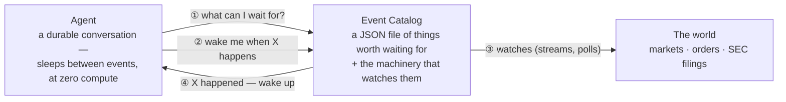
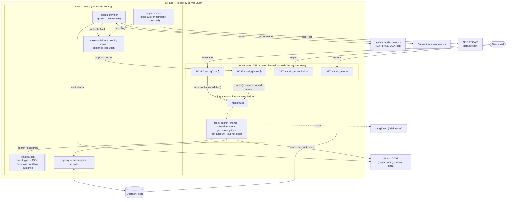
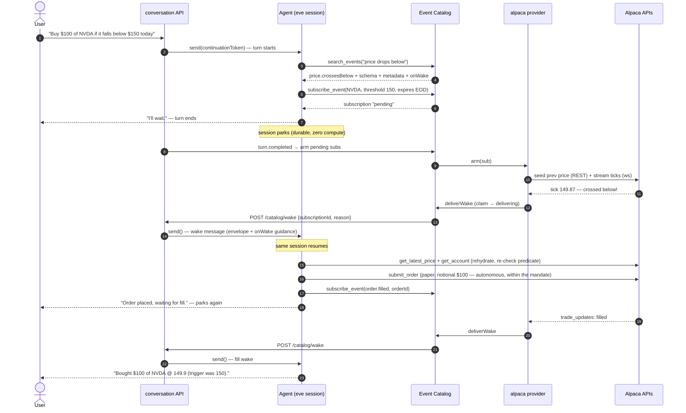
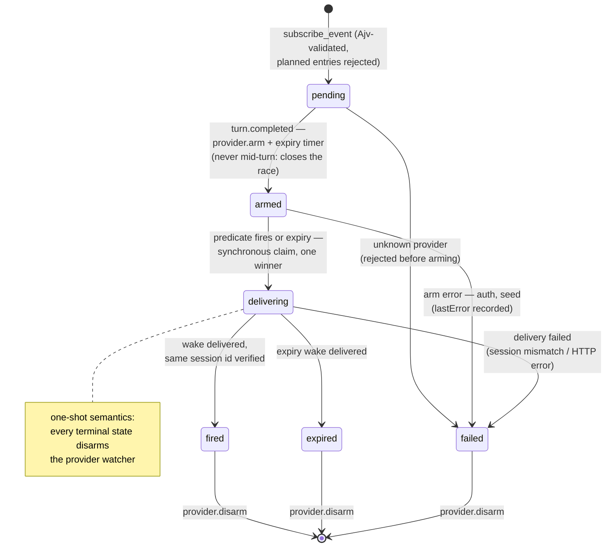

# Event Catalog — architecture deep-dive

*Technical companion to the [README](../README.md): full component map, the demo as a sequence
diagram, the subscription state machine, and design rationale in detail.*

**Tool calls are how agents call the world; events are how the world calls back. The Event
Catalog is where agents discover and subscribe to them.**

AI agents are excellent at reacting *now* and terrible at reacting *later*. This POC gives an
[eve](https://eve.dev) agent the missing primitive: **"wake me when X happens."** The agent
discovers event sources it knows nothing about, subscribes with typed predicates, suspends
(durably, at zero compute), and is resumed by the catalog when the event fires — interrupts for
AI agents. The vertical slice is agentic trading: Alpaca paper trading + SEC EDGAR filings.

The demo sentence the whole system exists for:

> *"Buy $100 of NVDA if it falls below $150 today."*

The agent finds the right event source in the catalog, subscribes, parks, wakes on the price
cross, re-checks reality, paper-trades autonomously within the stated mandate, parks again, and
reports the fill — without a single polling loop in agent code and without a human in the loop.

**eve in two sentences** (enough to read the diagrams; the rest is at [eve.dev](https://eve.dev)):
an eve *session* is a durable conversation — it can pause ("park") for hours at zero compute,
survive restarts, and be resumed later by whoever holds its resume key (the *continuation
token*). Everything below runs locally in dev, including the workflow engine — "durable" does
not mean "in Vercel's cloud" here.

## The big picture



That's the whole idea. The agent never polls, never holds a connection, never knows Alpaca or
SEC exist — it asks the catalog what can be waited for, subscribes, and goes to sleep. The
catalog does the watching and calls back. You talk to the agent with `POST /catalog/chat`
(each `conversationId` is one ongoing conversation); it lives next to `/catalog/wake` because
of an eve rule: only whoever *starts* a conversation holds the key to *resume* it — and the
catalog must hold that key to wake sleeping agents.

<details>
<summary><b>Under the hood</b> — the full component map</summary>



</details>

Key moves, bottom to top:

- **The catalog is a JSON file.** `catalog/catalog.json` declares every event type: a
  model-facing description, a JSON Schema for its parameters (enforced with Ajv, a JSON Schema
  validator, at subscribe time — the schema the model reads during discovery is the one that
  validates its input), honest provider metadata (freshness, latency, auth, cost, durability),
  and `onWake` — prompt-shaped handling guidance delivered back to the agent when the event
  fires. Entries whose provider isn't implemented yet are marked `"planned"`: search labels
  them, subscribe rejects them, and a boot-time honesty check refuses to advertise any "active"
  entry without a registered handler.
- **Providers watch the world so agents don't.** Push when the source offers it (Alpaca: one
  shared market-data websocket, one account-level `trade_updates` stream), coalesced polling when
  it doesn't (EDGAR: one 30s poll loop per watched company — keyed by CIK, SEC's numeric company
  id — regardless of subscriber count). REST is only for *seeding* state when a subscription
  arms (see below), never for watching.
- **The wake is the primitive.** Waking an agent is one `send()` on the conversation's
  continuation token — same session, full memory, plus an envelope that makes time-passage
  explicit. Delivery loops back over HTTP into the conversation API (rather than an in-process
  call) because that component alone holds the resume keys — and it makes every
  wake visible in the logs. The wake route (like chat) requires a shared bearer secret
  (`CATALOG_API_SECRET`, checked before any session-touching code) — and it *still rejects* any
  caller-supplied guidance, because even a secret-holder must not inject model-trusted
  instructions: those can only come from `catalog.json`, resolved server-side. Event payloads
  are data, never instructions.

## The demo flow



("Notional" = a dollar-amount order, not a share count. "Arming" a subscription = the provider
actually starts watching for it; disarming stops the watching.)

Two details that look small and aren't:

- **Arm-on-turn-complete** (step 9): subscriptions stay `pending` while the agent's turn is still
  running and arm only after it ends — otherwise a fast tick could try to wake a session that
  hasn't parked yet. The honest flip side: the world isn't watched until arming, so a price that
  crosses *and comes back* during those few in-turn seconds is never seen — the baseline
  ("seeded prev") is the price at arm time.
- **Rehydrate + re-check** (step 15): "price crossed 150" is not "price is still 150" — a
  time-of-check-to-time-of-use (TOCTOU) gap. The wake's `onWake` guidance tells the agent its
  snapshot is stale by definition; it re-fetches reality before acting, and declines to trade if
  the condition no longer holds — that judgment is the agent's own; there is no human in the
  loop (a deliberate full-autonomy choice; see Honest boundaries).

## Subscription lifecycle



(Once armed, transient provider trouble — an EDGAR poll error, a websocket hiccup — logs loudly
and keeps watching; it does not fail the subscription.)

Every transition is visible at `GET /catalog/subscriptions` (status, timestamps, `lastError`) —
the lifecycle *is* the observability model. Wakes are effectively-once: at-least-once delivery
plus a synchronous in-process claim and idempotent resume, with a session-id check that detects
(loudly) if eve's delivery fallback ever mints a fresh session instead of resuming the right one.
Multiple wakes aimed at one session (say, two subscriptions firing together) arrive as
sequential turns — eve buffers deliveries to a busy session.

## What the catalog offers today

"Edge-triggered" below means the price must actually *cross* the threshold — the provider seeds a
baseline price when the subscription arms and fires only on a genuine crossing, never because the
price already sat past the threshold.

| provider | event | how it watches | freshness | auth | cost |
|---|---|---|---|---|---|
| alpaca | `price.crossesBelow` | shared websocket, edge-triggered vs seeded baseline | real-time (IEX) | paper keys | free |
| alpaca | `price.crossesAbove` | same | real-time | paper keys | free |
| alpaca | `order.filled` | `trade_updates` push, REST seed at arm; wakes on **any** terminal status | real-time (sub-second push) | paper keys | free |
| edgar | `filing.new` | 30s poll per company (CIK), subscribers coalesced, accession diff | minutes | none (User-Agent required) | free |

A subscription whose condition never triggers simply expires — and the agent tells you the
condition never *triggered* while it watched (which is not a claim about where the price was).

## Running it

Prereqs: Node ≥ 24 and pnpm (exact version pinned via `packageManager`), a
[Vercel](https://vercel.com) account, an [Alpaca](https://alpaca.markets) **paper** account, and
optionally a [LangSmith](https://smith.langchain.com) key — tracing is a silent no-op without
one; the agent runs fine.

First-time setup from a fresh clone:

```bash
pnpm install
vercel link                    # creates/links YOUR Vercel project (model auth rides on it)
vercel integration add upstash/upstash-kv   # provisions the Redis that backs the registry
vercel env add <NAME> development           # once per var in .env.example (Alpaca keys, etc.)
vercel env pull .env.local --yes            # writes .env.local, incl. a VERCEL_OIDC_TOKEN
```

Secrets live in *your* Vercel project's env store, not in local files: `vercel env pull`
**overwrites** `.env.local` wholesale, so anything added only locally is lost on the next pull.
The `VERCEL_OIDC_TOKEN` (model auth via Vercel's AI Gateway — no provider API key needed) expires
after ~12h: re-pull before a session, and only while the dev server is **down** — any
`.env.local` write hot-reloads the server and drops in-process state (`KNOWN_ISSUES.md` #2).

```bash
pnpm dev          # eve dev server on port 2000
pnpm test         # 86 node:test cases (needs the Redis creds in .env.local)
pnpm typecheck
```

Talk to the agent:

```bash
# start a conversation (returns a sessionId; replace the price!)
curl -s -X POST localhost:2000/catalog/chat -H 'content-type: application/json' \
  -d '{"conversationId":"demo-1","message":"Buy $100 of NVDA if it falls below $175 today."}'

# watch the agent live
curl -N localhost:2000/catalog/sessions/<sessionId>/stream

# follow-ups are plain replies on the same conversation (same conversationId = same session)
curl -s -X POST localhost:2000/catalog/chat -H 'content-type: application/json' \
  -d '{"conversationId":"demo-1","message":"What are you waiting on right now?"}'

# inspect every subscription's lifecycle
curl -s localhost:2000/catalog/subscriptions | jq .
```

First run: expect `{"ok":true,...}` from `curl localhost:2000/eve/v1/health`, a `sessionId` in
the chat response, and NDJSON lifecycle events on the stream — `docs/acceptance-tests.md` AT-1
and AT-2 spell out exactly what success looks like, step by step; AT-3 … AT-9 script everything
else. If something misbehaves, read `KNOWN_ISSUES.md` before debugging — it's probably in there.

Demo guidance: run during US market hours (9:30–16:00 ET); pick a threshold slightly **below**
the current price (edge-triggered — it has to cross downward). Off-hours, `ALPACA_DATA_FEED=test`
(restart required) streams Alpaca's 24/7 synthetic ticker `FAKEPACA` through the same pipeline —
useful for watching connect/seed/arm and tick flow, but note its price prints flat in practice,
so *crossings* won't fire on it; expiry wakes and EDGAR wakes work any time.


## Observability

- **LangSmith** (optional): every turn exports OTel spans (model calls, tool calls, full
  inputs/outputs) to the project in `$LANGSMITH_PROJECT`. Requires `LANGSMITH_TRACING=true`
  (silent no-op without it — see KNOWN_ISSUES #6).
- **eve Agent Runs**: sessions/turns/tool calls in the Vercel dashboard, no setup.
- **Catalog logs**: one structured line per action (`[catalog] …`, `[alpaca] …`, `[edgar] …`),
  always carrying conversation + subscription ids. The console tells the whole story.

## Honest boundaries

This is a local-first POC, and says so:

- eve **sessions** are durable (they survive restarts — that's the workflow engine). The
  catalog's **watchers** (websockets, poll loops, expiry timers) are in-process: a dev-server
  restart keeps subscriptions in Redis but drops the watching; re-subscribe. Arm failures are
  visible in `GET /catalog/subscriptions` (status `failed` + `lastError`), not pushed anywhere.
- The agent trades **fully autonomously** — no human approval gate (a deliberate choice,
  2026-07-12). Safety is capability-bounded instead: trading is hard-coded to Alpaca's **paper**
  host; notional, buy-side, market/day orders only; the agent's instructions cap it at the
  user's stated amount and require the post-wake re-check. There is no code path to real money.
  (eve's approval gate is one line to restore — `approval: always()` on the tool — or a policy
  function for bounded autonomy, e.g. auto-approve only within the mandate.)
- Only conversations started through `/catalog/chat` are wakeable (the resume key stays with
  whoever starts a conversation — an eve rule). Wiring another surface — Slack, a web UI —
  would need cross-surface wakes; out of scope here.
- For the production deployment story, see [Deploying to Vercel](#deploying-to-vercel) below.
  Cross-agent dedup, multi-region, and true webhook providers live in the PRD appendix, not in
  this code.

## Deploying to Vercel

The catalog's durable *data* is already cloud-shaped (subscriptions, lifecycle, conversation map
— all in Redis). What's process-shaped is the *watcher* tier: socket handles, poll timers, price
baselines, seen-sets, and the in-process delivery claim. Deployment is therefore a story about
where watchers run and how delivery survives multiple instances.

### What deploys today, unchanged in design

- **Agent, conversation/wake API, catalog library** → Vercel Functions + Workflows (eve's native
  production path).
- **Registry + conversation map** → Upstash Redis (already there).
- **Wake delivery** → `deliverWake` becomes a publish to a Vercel Queues topic; a consumer
  function calls the (now authenticated) wake route. Fired events are low-volume and
  must-not-lose, while raw ticks stay filtered at the provider edge — the envelope's
  `subscriptionId`-keyed idempotency was designed for at-least-once delivery from day one. The
  in-process claim `Set` must become a Redis claim with an **expiring delivery lease plus
  recovery** (claim-then-publish is a dual write: a crash between the two can strand a
  subscription in `delivering`).
- **Expiry timers** → a durable Workflow `sleep()` per subscription, or a sorted-set sweep.
- **EDGAR** → a scheduled *resource sweep*: one invocation loads all active CIKs, fetches each
  once, diffs seen-sets in Redis, and routes to every subscriber — the coalescing property
  survives even though the `setInterval` doesn't. One honesty note: Vercel Cron's floor is
  1 minute, which cannot preserve the catalog's advertised ~30s freshness; either downgrade
  `catalog.json` accordingly or drive the sweep from a Workflow `sleep(30s)` loop.
- **order.filled reconciliation** stays easy everywhere: only the terminal state matters, and a
  single REST read recovers it after any gap.

Deploying adapters onto different primitives does not dissolve the broker abstraction. The
abstraction is *subscription → provider adapter → normalized fired event → durable wake* — not
"all providers share one OS process." Topology hides behind the provider seam exactly the way
API differences already do.

### The narrow gap

Vercel can *assemble* an event broker from Workflows + Functions + Queues + Cron + Redis. What
it does not offer is a **continuously-owned outbound connector runtime**: a primitive that holds
a long-lived connection with an uninterrupted source cursor, shared mutable subscription
membership, and instance affinity. Websockets are where this bites first; it's the only piece of
this system with no clean Vercel home today. For this POC, that tier runs locally.

### The future stream adapter (not built; prerequisites known)

The credible Vercel-native shape for the Alpaca streams is a Workflow chaining bounded
~25-minute socket sessions (steps run as Fluid Function invocations, up to 800s GA / 30 min
beta; the Workflow supplies the "forever" and carries state between steps). Before building it,
four problems need real designs — they are correctness issues, not polish:

1. **Historical gap replay.** Re-seeding from the latest REST trade after a reconnect breaks
   edge-trigger semantics: if the price crosses below the threshold *and recovers* during the
   gap (prev 151 → gap: 149 then back to 151 → new seed 151), the crossing is silently lost and
   the agent never wakes. The fix is a persisted per-symbol cursor, historical fetch over the
   gap, merge with buffered live trades in source order, dedupe by trade id, and run every trade
   through the predicate. (The local POC has a milder cousin of this hole — a restart during a
   cross also misses it — which is inside the documented "restart = re-subscribe" boundary.)
2. **Fenced ownership.** The account allows one market-data connection; chained sessions need a
   Redis lease *with a fencing token*, so a delayed old session can't coexist with its
   replacement.
3. **Dynamic membership.** A subscription arming mid-step can't mutate a running step's memory
   (no instance affinity); the step must poll Redis membership or be interruptible.
4. **Idempotent recovery.** A step killed after publishing a wake but before recording
   completion will retry; publishes and state writes must be idempotent by stable keys.

Cost is not the blocker (an always-on Standard instance is roughly $15–20/month before active
CPU; market-hours-only is less). The design work is.

### How `workflow@4.6.0` expresses "forever" (gate 7 — resolved 2026-07-12)

Research verified against the actual `workflow@4.6.0` / `@workflow/core@4.6.0` tarballs and
Vercel's live docs (full report in the session transcript; key sources:
vercel.com/docs/workflows/pricing, /docs/workflows/concepts, /docs/functions/limitations,
github.com/vercel/workflow).

- **There is no `continueAsNew` primitive.** Run-forever = **recursion across runs**: the
  workflow's final step calls `start(sameWorkflow, [state])` (`workflow/api`) and returns. Each
  fresh run resets the per-run ceilings. This is exactly the mechanism behind Rauch's
  "runs forever" chess demo (last step starts a new run).
- **Per-run ceilings that kill an in-run `while(true)`**: 25,000 events hard cap (a step costs 3
  events, a sleep 2), 10,000 steps, 240s max replay. Practical guidance from Vercel: chain to a
  new run well before ~2,000 events. Run duration and `sleep()` duration are **unlimited**.
- **A websocket-holding step is capped by the Fluid function ceiling**, not by Workflows: Pro
  800s GA, 1800s beta (needs per-function `maxDuration` config; unsupported with Secure
  Compute/Static IPs). So socket sessions are **~12–13 min on GA**, 25+ min only on the beta
  ceiling. Shorter sessions just mean more chaining + more gap replays — acceptable.
- **Steps are stateless and retry from the top** (3 auto-retries by default; `RetryableError` /
  `FatalError` to tune). Consequences for the connector: write events through to the registry
  *as they arrive inside the step* (never batch at step end), make all writes idempotent, and
  treat a socket drop as a graceful `return` (let the loop reopen) — reserve `throw` for genuine
  connect failures so a 12-minute session is never re-run from scratch over a last-minute close.
- **Waiting/interruption**: `sleep()` (durable, unlimited), `createHook()`/`createWebhook()`
  (park until external push via `resumeHook`/webhook URL), `Run.wakeUp()` (interrupt a pending
  sleep from outside). Stop a perpetual loop by checking a flag/hook in-run and returning
  instead of re-invoking.
- **No Next.js required**: 4.6.0 ships adapters for Next, Nuxt, **Nitro**, SvelteKit, Astro,
  Nest, and Vite/Rollup; a minimal standalone Vercel Service can use the Nitro or Vite path.
- **⚠️ Open bug to verify before relying on frequent `sleep()`**: vercel/workflow **issue #634**
  ("Steps Don't Run After Sleep" — resume sometimes fails, worse around the ~30-min mark;
  reported on 4.0.1-beta.32, fix status in 4.6.0 unconfirmed). Affects the EDGAR sleep(30s)
  sweep and any campaign cadence — smoke-test sleep-resume on a preview deploy early in Phase 2,
  and prefer hook/`wakeUp()`-driven resumes over many small sleeps if it reproduces.

Shape for both consumers: **bounded loop of N steps inside a run (keep events < ~2,000), then
`return await start(self, [cursor|state])`** — the connector chains socket-session steps with
the cursor as carried state; the campaign chains tick/sleep rounds with a stop-check step each
round.

### Vercel Queues from Nitro (Phase 1 smoke test, resolved 2026-07-12)

`@vercel/queue@0.4.0` (current on npm as of this date) `send()`/`handleCallback()` **round-trips
cleanly from a Nitro route, locally, against the real Vercel Queue Service** — confirmed with a
throwaway Nitro app (`spikes/vercel-queue-smoke/`, not part of the app): a `GET /send` route
called `send("catalog-smoke-test", payload)`, which returned a real `messageId` from VQS; the
dev-mode consumer received and processed that exact payload in-process within ~3s, observable
via a second route. Two things worth knowing before Phase 2 builds on this:

- **Nitro needs `registerDevConsumer`, not file-based `handleCallback` discovery.** The SDK's
  local dev mode (`NODE_ENV=development`, no `VERCEL_DEPLOYMENT_ID`) normally auto-discovers
  `handleCallback`-exported route handlers via `vercel.json`'s `experimentalTriggers` map — but
  that convention is documented only for Next.js/Nuxt/SvelteKit. Nitro instead needs
  `registerDevConsumer({ topic, client, handler })`, called once (e.g. in a Nitro plugin) —
  TSDoc-only (not in the README), added for exactly this "central dispatcher" case. In
  production, Vercel invokes the deployed route directly per `vercel.json`, so this is a dev-only
  wrinkle, not a production concern.
- **Nitro's own `serverDir` config defaults to `false`** (no automatic `routes/`/`plugins/`
  directory scanning) — trivial once known, but silently 404s every route with no hint why until
  set explicitly (`serverDir: "./"` for root-level `routes/`/`plugins/`, or `"./server"` for a
  `server/` subdirectory).
- **Minor peer-dependency lag**: `nitro@3.0.260610-beta` (the exact version eve vendors)
  declares `@vercel/queue` as a `peerOptional` pinned to `^0.3.0`, one minor behind the `0.4.0`
  actually on npm; `registerDevConsumer` exists in both, so this didn't block anything, but it
  needed `--legacy-peer-deps`/`--force` to install both together and is worth re-checking when
  nitro's peer range catches up.

Not exercised (out of scope for a smoke test, and arguably untestable without a real deployment
anyway): a genuine production-shape HTTP invocation of a `handleCallback`-wrapped route — Vercel
constructs and sends that request itself in production, which is exactly why `registerDevConsumer`
exists as the local stand-in. That remains a Phase 6 (`AT-14`) concern, alongside the rest of the
world-vercel re-verification.

### Prior art — every layer exists somewhere, the stack exists nowhere

The case for building this *into eve* is that competitors already ship the pieces:

- **The suspend-until-event primitive**: Inngest's `step.waitForEvent()` is the mature version —
  a durable function parks at zero compute until an event matching a CEL predicate expression
  arrives, with a timeout (predicate + expiry, almost exactly our subscription shape). Same
  family: Temporal signals, Restate awakeables, Step Functions task tokens.
- **Agent + connector runtime in one primitive**: Cloudflare's Agents SDK — the `Agent` class
  *is* a Durable Object (per-agent SQLite state, WebSockets, alarms, 2026's `keepAlive()` and
  durable-execution fibers). On that stack there is no laptop-shaped watcher tier at all.
- **The provider catalog**: Pipedream and Zapier operate thousands of managed event sources —
  but aimed at workflows, not at waking suspended agents with typed predicates.

No one has assembled the three into what this POC is: an agent-discoverable, schema-enforced
catalog of events + predicate subscriptions + wakes delivered into an agent conversation. That
assembly gap is the opportunity — and each layer existing elsewhere is the evidence the demand
is real.

### Where the connector primitive already exists

Worth naming plainly: the missing connector runtime *does* exist elsewhere. **Cloudflare Durable
Objects** are the closest match — identity-addressed single-threaded actors with durable
storage, in-memory state, alarms that resurrect an actor that died mid-process, and (since
[June 2026](https://developers.cloudflare.com/changelog/post/2026-06-19-outbound-connections-keep-dos-alive/))
outbound WebSocket connections that keep the actor alive (~15 minutes per connection). A
DO-per-stream / DO-per-CIK-with-30s-alarm mapping fits this system naturally and even preserves
the EDGAR freshness contract that Cron's 1-minute floor breaks. Gap replay and fencing are still
required — that correctness work is platform-independent. The pragmatic alternative is one
always-on container (Fly.io / Railway) running the watcher tier extracted from the eve process;
the seam it needs (Redis registry + authenticated wake HTTP) already exists. Both are non-Vercel
components and would need explicit approval under AGENTS.md rule 2; neither is being built now.

## Map of the repo

| path | what |
|---|---|
| `docs/prd-draft.md` | the original PRD (historical — kept as written; where the implementation deliberately deviates, e.g. full autonomy instead of trade approvals, this README's Honest boundaries section is the record) |
| `docs/acceptance-tests.md` | manual test scripts per milestone (AT-1 … AT-9) |
| `AGENTS.md` | project rules (north star, Vercel-primitives-only, catalog honesty, TDD) |
| `KNOWN_ISSUES.md` | every sharp edge found building on eve 0.22.5 beta — read before touching channel code |
| `agent/` | the eve agent: a 19-line prompt, 5 tools, the conversation/wake API, OTel |
| `catalog/` | the Event Catalog: `catalog.json`, registry, wake, providers |
